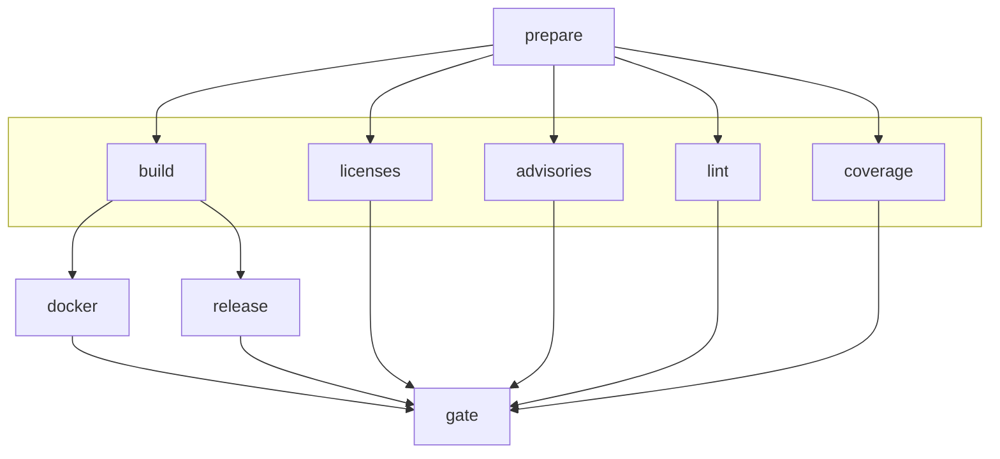

# CI/CD Pipeline

This document describes the GitHub Actions CI/CD pipeline for opensovd.

## Build Environment

The Linux and macOS jobs run inside the [Nix flake](../flake.nix) dev shell
(`nix develop --command ...`), so CI and local development share one set of tool
versions. Every in-shell command goes through the `RUN` variable, which holds
`nix develop --command`. Windows has no Nix port and keeps `setup-rust-toolchain`,
so the build job overrides `RUN` to empty there and each command still exists once.

The commands themselves are [just](https://just.systems/) recipes from the
[`justfile`](../justfile), so a CI step and a local invocation run the same
flags. Windows takes `just` from `extractions/setup-just` rather than the flake,
and that pin has to move in step with the version nixpkgs provides, or a recipe
can behave differently per leg. The justfile names bash explicitly for both
`shell` and `script-interpreter`, because that leg has neither a dependable `sh`
nor the cygpath a `#!/usr/bin/env` recipe would need to resolve its interpreter.

`.github/actions/nix-setup` installs Nix and restores the cargo cache. The store
itself is served by cache.nixos.org; a 3.3 GB closure does not fit the Actions
cache budget alongside the cargo caches.

Since the store is fetched per job, the flake exposes a second, smaller shell.
`licenses`, `advisories` and `lint` run static checks only, so they enter
`.#lint`, which leaves out the tools those jobs never call: 2.3 GB against the
3.3 GB of the default shell. Each passes `shell: '.#lint'` to `nix-setup`, so the
step that realises the shell fetches the same one, and overrides `RUN` to
`nix develop .#lint --command`. The shell carries the whole hook set, so the
floor is the Rust toolchain the rustfmt and clippy hooks need.

The `.nix` files go through the nixfmt hook, like every other file type. `lint`
also runs `nix flake check --all-systems`, which evaluates the outputs for every
system in about a second and builds none of them.

The git hooks are defined in [`nix/git-hooks.nix`](../nix/git-hooks.nix)
and run through [git-hooks.nix](https://github.com/cachix/git-hooks.nix), which
generates `.pre-commit-config.yaml` on shell entry. The hooks take their tools
from the shell, so nothing is fetched per hook. They are kept out of
`nix flake check`, because the cargo and ty hooks need the crates.io registry
and a synced virtualenv that the sandbox does not provide.

## Jobs

| Job            | Runs On                | Description                                                                           |
|----------------|------------------------|---------------------------------------------------------------------------------------|
| **prepare**    | Always                 | Entry point; determines release type and whether to run (skips nightly if no changes) |
| **build**      | When `should_run=true` | Builds for Linux, Windows, macOS; runs tests and pytest                               |
| **licenses**   | When `should_run=true` | Checks licenses and sources with cargo-deny                                           |
| **advisories** | When `should_run=true` | Checks security advisories with cargo-deny                                            |
| **lint**       | When `should_run=true` | Runs the git hooks (prek), including rustfmt and clippy                               |
| **coverage**   | When `should_run=true` | Generates coverage report, deploys to GitHub Pages on main                            |
| **docker**     | main/tags/schedule     | Builds and pushes Docker images (gateway, mcp) to GHCR                                |
| **release**    | main/tags/schedule     | Creates GitHub release with artifacts and changelog                                   |
| **gate**       | Always                 | Final check that all jobs passed (use for branch protection)                          |

## Dependency Chain

Jobs `build`, `licenses`, `advisories`, `lint`, and `coverage` run in parallel after `prepare`.

## Nightly Skip Logic

The `prepare` job compares the current SHA with the `nightly` tag. If unchanged, it sets `should_run=false` and all downstream jobs are skipped, saving CI resources.

## Release Tags

| Tag       | Trigger            | Channel   | Description                                     |
|-----------|--------------------|-----------|-------------------------------------------------|
| `latest`  | Push to main       | `dev`     | Latest successful main branch build             |
| `nightly` | Daily at 02:00 UTC | `nightly` | Scheduled nightly build (skipped if no changes) |
| `vX.Y.Z`  | Tag push           | `stable`  | Versioned production release                    |

## Release Channels

The channel determines the version suffix the binaries report through `--version`,
the SOVD vendor info and the MCP handshake. Only `stable` ships unsuffixed:

| Channel   | Version string  | Built by                             |
|-----------|-----------------|--------------------------------------|
| `stable`  | `0.1.1`         | Tag push, after the tag is validated |
| `nightly` | `0.1.1-nightly` | Scheduled build                      |
| `dev`     | `0.1.1-dev`     | main, pull requests, local builds    |

The suffixes are semver pre-releases, so `0.1.1-dev` sorts before `0.1.1-nightly`,
which sorts before `0.1.1`.

The `prepare` job derives the channel from the release type and passes it to
`build`. Downstream jobs test `channel != 'stable'` wherever they need to know
whether a build is a prerelease. Three environment variables feed the build scripts, all optional and all
defaulting to a dev build stamped from the local git checkout:

| Variable              | Purpose                                                          |
|-----------------------|------------------------------------------------------------------|
| `OPENSOVD_CHANNEL`    | Release channel; an unrecognised value fails the build            |
| `OPENSOVD_COMMIT_SHA` | Revision to stamp, for builds without a git checkout              |
| `SOURCE_DATE_EPOCH`   | Build date to stamp, for reproducible builds                      |

On a tag push `prepare` verifies that the tag matches the workspace version and
fails the run on a mismatch, so a `v0.2.0` tag cannot ship binaries reporting
`0.1.1`.

## Docker Tags

| Tag                  | When Created        | Description                            |
|----------------------|---------------------|----------------------------------------|
| `latest`             | main or version tag | Points to the most recent stable build |
| `nightly`            | Scheduled build     | Latest nightly build                   |
| `nightly-YYYY-MM-DD` | Scheduled build     | Date-stamped nightly build             |
| `vX.Y.Z`             | Version tag push    | Specific version release               |

## Branch Protection

Use the `gate` job as the required status check for branch protection rules.
