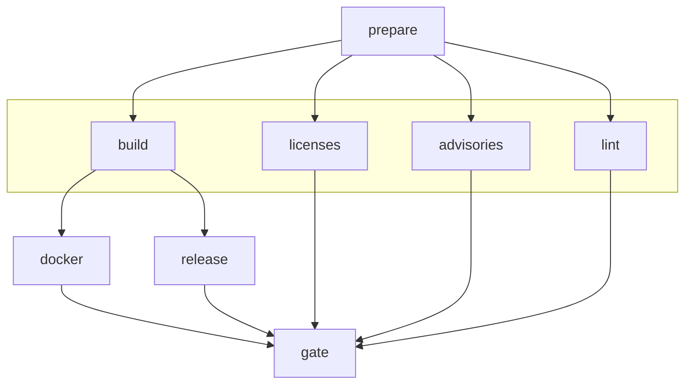

# CI/CD Pipeline

This document describes the GitHub Actions CI/CD pipeline for opensovd.

## Build Environment

Every job that needs tools installs them from [`mise.toml`](../mise.toml) through
`.github/actions/mise`, locked by `mise.lock`, the same set `mise install` gives a
dev machine. The action takes the mise version from `.devcontainer/Dockerfile`.
The jobs run the tasks defined in `mise.toml`, so `mise run lint`,
`mise run test`, `mise run coverage`, `mise run licenses` and
`mise run advisories` reproduce them locally, and `mise run build` builds the
binaries the build job ships. `mise run ci` runs all of them but coverage.
`build`, `test:unit`, `test:integration`, `coverage` and `container` take the
binaries to work on, `binaries` in `mise.toml` by default, and pass arguments after
`--` to cargo or pytest, so `mise run test:unit gateway -- --no-fail-fast` tests only
the crates the gateway is built from.

## Build Matrix

The build job runs once per `binary` and `target` of its matrix. A binary `<name>` is
the package `opensovd-<name>`, with its e2e tests in `tests/opensovd-<name>/` and its
image in `docker/Dockerfile.<name>`; the docker matrix and `binaries` in `mise.toml`
list it too. Each target entry sets:

| Field       | Meaning                                                                       |
|-------------|-------------------------------------------------------------------------------|
| `triple`    | Rust target to build for                                                      |
| `os`        | Runner                                                                        |
| `tests`     | `test:` tasks the job runs: `unit`, `integration`                             |
| `coverage`  | Run those tests instrumented through `mise run coverage` instead              |
| `container` | Build and smoke-test the image for the triple's architecture (Linux only)     |

## Reports

Every stage writes its report to `target/reports/<binary>/<triple>/<stage>/`:
`test:unit` the nextest JUnit report as `unit/junit.xml`, `test:integration` an HTML
report as `integration/index.html`, `coverage` an HTML report under `coverage/html/`
with `coverage.json`, `cobertura.xml`, `summary.md`, `detail.md` and a shields.io
`badge.json`. The build jobs upload the directory as
`reports-<binary>-<triple>`, coverage jobs post `summary.md` as a PR comment, and on
main GitHub Pages serves every report under the same path.

## Images

On releases the docker job builds one image per binary from the binaries of its
`container` targets and pushes all its platforms together.

## Jobs

| Job            | Runs On                | Description                                                                           |
|----------------|------------------------|---------------------------------------------------------------------------------------|
| **prepare**    | Always                 | Entry point; determines release type and whether to run (skips nightly if no changes) |
| **build**      | When `should_run=true` | Builds, tests or covers each binary per target; smoke-tests images on Linux           |
| **licenses**   | When `should_run=true` | Checks licenses and sources with cargo-deny                                           |
| **advisories** | When `should_run=true` | Checks security advisories with cargo-deny                                            |
| **lint**       | When `should_run=true` | Runs the git hooks (prek), including rustfmt and clippy, and the plugin self-tests    |
| **docker**     | main/tags/schedule     | Pushes a multi-arch Docker image per binary to GHCR                                   |
| **release**    | main/tags/schedule     | Creates GitHub release with artifacts and changelog                                   |
| **gate**       | Always                 | Final check that all jobs passed (use for branch protection)                          |

## Dependency Chain

```mermaid
flowchart TB
    prepare
    subgraph parallel[ ]
        direction LR
        build
        licenses
        advisories
        lint
    end
    prepare --> build & licenses & advisories & lint
    build --> docker & release
    docker & release & licenses & advisories & lint --> gate
```

Jobs `build`, `licenses`, `advisories` and `lint` run in parallel after `prepare`.

## Nightly Skip Logic

The `prepare` job compares the current SHA with the `nightly` tag. If unchanged, it sets `should_run=false` and all downstream jobs are skipped, saving CI resources.

## Release Tags

| Tag       | Trigger            | Channel   | Description                                     |
|-----------|--------------------|-----------|-------------------------------------------------|
| `latest`  | Push to main       | `dev`     | Latest successful main branch build             |
| `nightly` | Daily at 02:00 UTC | `nightly` | Scheduled nightly build (skipped if no changes) |
| `vX.Y.Z`  | Tag push           | `stable`  | Versioned production release                    |

## Release Channels

The channel determines the version suffix the binaries report through `--version`,
the SOVD vendor info and the MCP handshake. Only `stable` ships unsuffixed:

| Channel   | Version string  | Built by                             |
|-----------|-----------------|--------------------------------------|
| `stable`  | `0.1.1`         | Tag push, after the tag is validated |
| `nightly` | `0.1.1-nightly` | Scheduled build                      |
| `dev`     | `0.1.1-dev`     | main, pull requests, local builds    |

The suffixes are semver pre-releases, so `0.1.1-dev` sorts before `0.1.1-nightly`,
which sorts before `0.1.1`.

The `prepare` job derives the channel from the release type and passes it to
`build`. Downstream jobs test `channel != 'stable'` wherever they need to know
whether a build is a prerelease. Three environment variables feed the build scripts, all optional and all
defaulting to a dev build stamped from the local git checkout:

| Variable              | Purpose                                                          |
|-----------------------|------------------------------------------------------------------|
| `OPENSOVD_CHANNEL`    | Release channel; an unrecognised value fails the build            |
| `OPENSOVD_COMMIT_SHA` | Revision to stamp, for builds without a git checkout              |
| `SOURCE_DATE_EPOCH`   | Build date to stamp, for reproducible builds                      |

On a tag push `prepare` verifies that the tag matches the workspace version and
fails the run on a mismatch, so a `v0.2.0` tag cannot ship binaries reporting
`0.1.1`.

## Docker Tags

| Tag                  | When Created        | Description                            |
|----------------------|---------------------|----------------------------------------|
| `latest`             | main or version tag | Points to the most recent stable build |
| `nightly`            | Scheduled build     | Latest nightly build                   |
| `nightly-YYYY-MM-DD` | Scheduled build     | Date-stamped nightly build             |
| `vX.Y.Z`             | Version tag push    | Specific version release               |

## Branch Protection

Use the `gate` job as the required status check for branch protection rules.
